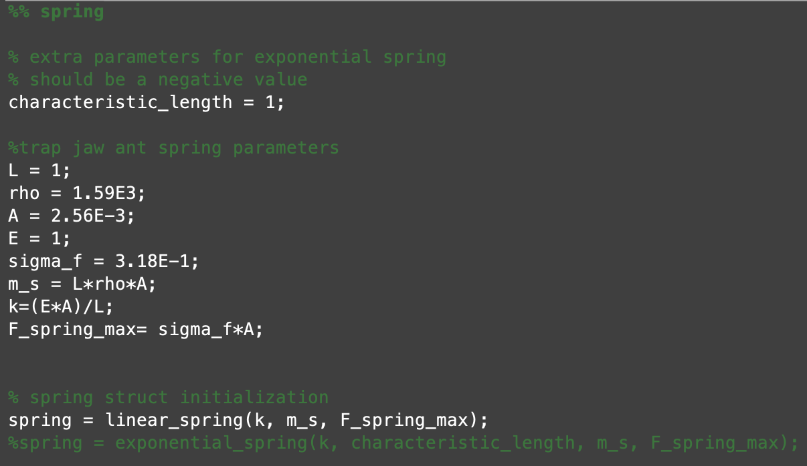
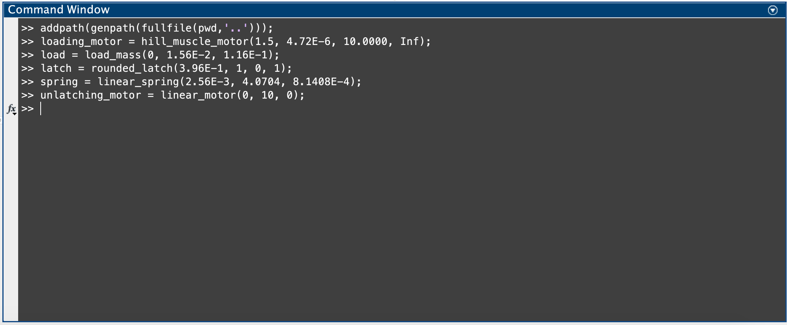
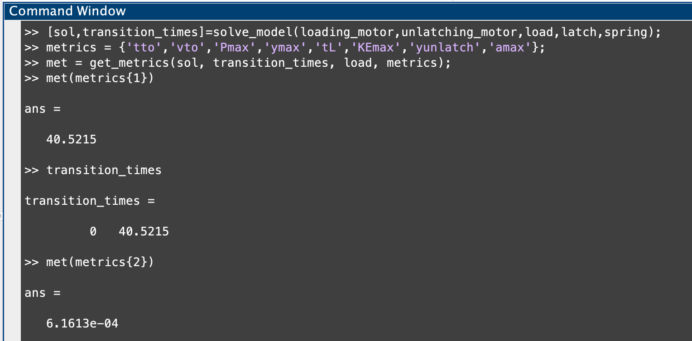

# MATLAB LaMSA Model

[](https://zenodo.org/badge/latestdoi/263460081)


## Installing the Model

To install the model, click [here](https://github.com/posmlab/matlab-lamsa-model/archive/master.zip), or select the "Download ZIP" option from the "Code" dropdown at [the top of our github repository](https://github.com/posmlab/matlab-lamsa-model).


## Using the Graphical User Interface

**Open app/plot_app.mlapp in MATLAB for a graphical user interface to run the model.**

With the GUI open, you will see a small diagram of the system in the bottom right, with a large input parameter box on the left and plotting options in the top right. Since the default values for all of the parameters are already loaded, you should be able to run the simulation without changing anything in the parameters box and simply use the plotting options to gain familiarity with the GUI. 

However, in order to best understand the capabilities of the GUI it is highly recommended you watch this [YouTube video on Using the MATLAB LaMSA Model](https://youtu.be/c-lTELC9GgM) detailing the different kinds of plots that can be made and how to access them.


## The Repository

### Navigating the Repository
Within the repository itself, we have 4 subdirectories:

**app**
In the app subdirectory you will find all the necessary files for the GUI to run. However, the only file you will need to open in order to use it is <br>plot_app.mlapp

**ext**
The ext subdirectory contains all of the files outside of the project that we used when writing the code for the model. Here is a quick summary of the files that can be found here:
+ [linspecer.m](https://www.mathworks.com/matlabcentral/fileexchange/42673-beautiful-and-distinguishable-line-colors-colormap) 
  - A function allowing us to make nicer colormaps for our LaMSA zone plots
+ [prettyjson.m](https://github.com/ybnd/prettyjson.m) 
  - A function to make the parameter output file from solve_model.m more readable
+ [mlapp2classdef.m](https://github.com/StackOverflowMATLABchat/mlapp2classdef) 
  - A function we use to update the GUI code from plot_app.mlapp into a human-readable plot_app.m file (used for tracking changes in Github) 
+ sensitive_axes.m 
  - A function for performing a sensitivity analysis on the model output. This code is still under development, use at your own risk!
+ metsol_eval.m 
  - A helper function that provides a wrapper for the LaMSA model to be used with the sensitive_axes.m function
+ relative_gradient.m 
  - A helper function for sensitive_axes.m, which calculates the gradient of a multi-dimensional function as a percent change of the input

**lib**
The lib subdirectory is where the majority of the code that actually runs the model is stored. The main files in this directory are:
+ heatmap_demo.m
  + creates a 2D heatmap of the LaMSA system performance by iterating over component parameters; calls solve_model.m and get_metrics.m for each combination of component parameters
+ LaMSA_zone.m
  + creates a 2D LaMSA Zone heatmap by iterating over component parameters; calls solve_model.m and get_metrics.m for each combination of component parameters
+ sensitivity_analysis.m
  + performs a sensitivity analysis on the input paramters to the model at a particular point in the parameter space by creating a wrapper function that is fed into /ext/sensitive_axes.m
+ get_metrics.m
  + extracts kinematic metrics (e.g. max power) from the output returned by solve_model.m
+ solve_model.m
  + runs an individual LaMSA simulation. We will take a closer look at a run of solve_model.m a bit further down. All of the remaining files in this subdirectory are helper functions for solve_model.m: 
+ unlatching_ode.m
  + defines the odinary differential equation to be solved during the unlatching phase of motion
+ unlatching_end.m
  + defines the ending condition for the unlatching phase of motion (when the normal force between the latch and load mass goes to zero)
+ launching_ode.m 
  + defines the odinary differential equation to be solved during the spring actuation phase of motion
+ launching_end.m
  + defines the ending condition for the spring actuation phase of motion (when the spring force goes to zero)
+ writeInfoToFile.m
  + writes the solution generated by solve_model.m to a file 
  

**components-library**
The components-library directory stores several structs used in calls to solve_model.m. In this directory, there are the subdirectories of /springs, /motors, /load-masses, and /latches. Within these subdirectories are structs for varying types of each of these components, such as specific latch shapes, varying motor and spring types, as well as a basic one for the load mass. These structs are then called in whatever specified combination in solve_model and heatmap_demo. In heatmap_demo there already exists code for each of these structs that can be commented out or commented back in to account for the various scenarios. Here is the current list of all types of components in the components-library:

Model Component     | Component Types   
------------------- | ------------------
Springs             | linear spring, exponential spring, linear-elastic-extensional spring
Motors              | linear motor, hill-muscle motor
Load-Masses         | load mass with Effective Mechanical Advantage
Latches             | rounded-quarter-circle latch

**docs**
The docs directory stores all of the documentation files for the repository (including this one!).

### Example Call of solve_model.m
solve_model.m has 5 required inputs and a final optional input with the following argument syntax:

``` matlab
[sol,transition_times]=solve_model(loading_motor,unlatching_motor,load,latch,spring, outputDirectory)
```
As you can see, solve_model.m uses many of the components outlined above as its inputs. Taking a peak inside heatmap_demo.m, we can see how to initialize some of these structs for input:



This is just an example for the spring, but to take a quick look at the actual input values used in this run we have:



Now, when we run solve model for the assigned components, we get the two outputs of sol and transition_times. sol is an 11 column matrix where each individual row represents the position, speed, and force values for the latch and load at an individual time value. transition_times is 2 value row vector where the first value is the unlatching time and the second is the launch time. If the unlatching time is 0, then you have instantaneous unlatching! Now, we can call solve_model.m using the defined components and begin to look at the kinematic metrics of the run using get_metrics.m:



As we see here, we can call out specific kinematic metrics using the different keys in metrics. These aren't all of the keys in get_metrics.m, so if you would like to see some of the others you can find them there. The first value in our list is tto or takeoff time, which is the same as launch time, and as we can see here the value matches with the time reported in transition_times! Then, as we move down to our second key in metrics we have our velocity at takeoff, and so on. Note in this call to solve_model.m, we did not include an outputDirectory, however, if you choose to add this the model will export two files: a .csv file with all of the info in sol, and a .json file with a list of the parameters used for the run. Also, if the outputDirectory submitted does not already exist, the model will make it for you.

**NOTE: This final input is left out in the calls to solve_model in both heatmap_demo.m and LaMSA_zone.m so that you do not accidentally fill up your storage with these .csv files as even a run at resolution of 100 pixels will take up several GB of storage.**


## Contact Information
Hopefully this file has been helpful but if you still have any questions regarding the model feel free to send them our way! Contact us at: milton@hmc.edu

