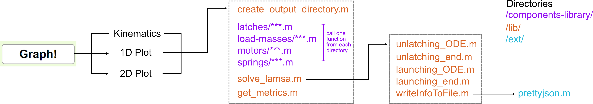
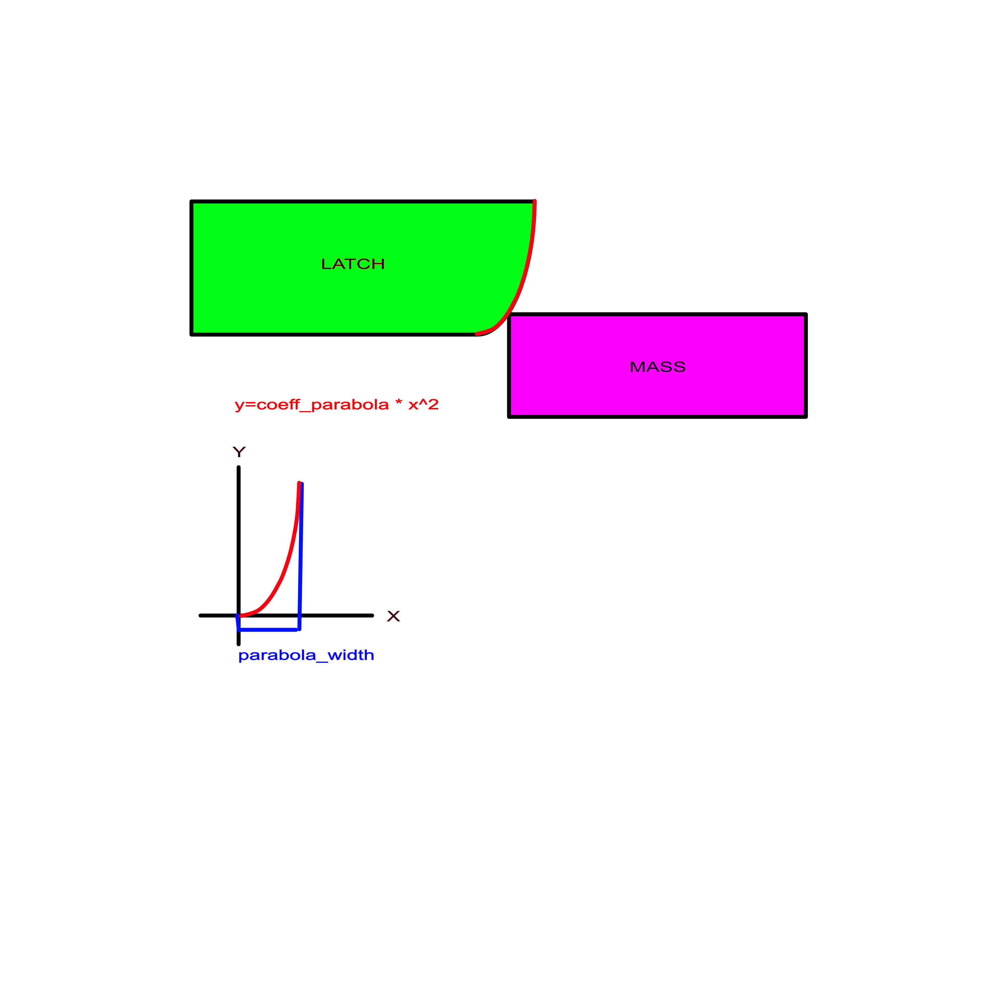

# LaMSA Template Model

[](https://zenodo.org/badge/latestdoi/263460081)

Table of Contents

- [LaMSA Template Model](#lamsa-template-model)
  - [Installing the Model](#installing-the-model)
  - [Using the Graphical User Interface](#using-the-graphical-user-interface)
  - [Creating New Components](#creating-new-components)
    - [parameters()](#parameters)
    - [constructor](#constructor)
  - [Example Component Construction: Parabolic Latch](#example-component-construction-parabolic-latch)
  - [The Repository](#the-repository)
    - [Navigating the Repository](#navigating-the-repository)
    - [Example Call of solve_lamsa.m](#example-call-of-solve_lamsam)
  - [Contact Information](#contact-information)

## Installing the Model

To install the model, click [here](https://github.com/posmlab/matlab-lamsa-model/archive/master.zip), or select the "Download ZIP" option from the "Code" dropdown at [the top of our github repository](https://github.com/posmlab/matlab-lamsa-model).


## Using the Graphical User Interface

**Open app/lamsa_template_model.mlapp in MATLAB for a graphical user interface to run the model.**

With the GUI open, you will see a small diagram of the system in the bottom right, with a large input parameter box on the left and plotting options in the top right. Since the default values for all of the parameters are already loaded, you should be able to run the simulation without changing anything in the parameters box and simply use the plotting options to gain familiarity with the GUI. 

However, in order to best understand the capabilities of the GUI it is highly recommended you watch this [YouTube video on Using the LaMSA Template Model](https://youtu.be/c-lTELC9GgM) detailing the different kinds of plots that can be made and how to access them.
<iframe width="560" height="315" src="https://www.youtube.com/embed/c-lTELC9GgM" frameborder="0" allow="accelerometer; autoplay; clipboard-write; encrypted-media; gyroscope; picture-in-picture" allowfullscreen>
</iframe>

<br> <br>

When the "Graph!" button is pressed on the GUI, the code executes according to this function dependency graph:



## Creating New Components
Components in the LaMSA model follow an object-oriented approach to maximize extensibility. Hence, any new class definition for a new component should inherit from the relevant object type. For example, a new spring class called “NewSpring” would have the following class definition:

``` matlab
classdef NewSpring < Spring
```
Each class definition for a new component must include a static method named parameters() and a constructor with behavior specified below. For additional information see the existing component scripts as examples.

### parameters()
The parameters section has a constant structure no matter the component. This function must return a string array with 5 (or 6, for motors) rows and as many columns as there are desired parameters for the new type of component. The first row must list the titles of the desired inputs. The second row must list the default inputs, in the same order. Note: the motors have three lines of parameters, with the first listing the titles of desired inputs, the second the default inputs for the loading motor, and the third listing the default inputs for the unlatching motor. The last two rows should contain minimum and maximum values for each parameter, respectively. For example, we could have the following parameters function:

``` matlab
methods (static)
      function params = parameters()
          params = [“param 1” “param 2” “param 3”;
                  “default 1” “default 2” “default 3”;
                                      “min 1” min 2” “min 3”;
              “max 1” “max 2” “max 3”];
      end
  end
``` 

### constructor
The constructor for each component must take the parameters specified in the parameters function in the order defined in the parameters function. The only other requirement for the constructor is that it returns an object (which is the type of the parent object from which the new object inherits). In order to do this, then, the constructor must define certain properties, which are simply the properties of the parent object. 

Parent Object | Properties
------------- | ----------
Mass | mass(y), EMA(y)
Latch | coeff_fric, v_0, max_width, mass, y_L(x), min_latching_dist, max_latching_dist, runway_length
Motor | max_force, range, velocity, Force(t,x)
Spring | Force(t,x), mass, range

For example, a new Spring object needs to define Force (as a function of t and x), mass, and range. Once these are defined, one can return a new Spring object by calling the parent constructor with the following:

``` matlab
 obj = obj@Spring(Force, mass, range);
```

## Example Component Construction: Parabolic Latch
To demonstrate the process of constructing a new component, let's step through the process of making the parabolic latch. Here's a diagram to show how it looks:


The parabolic latch only differs from the rounded latch in its shape, so we can use the rounded latch code as a template:
```matlab
%% rounded_latch object
% arguments in required order:
%     R - raduis of the latch
%     m_L - mass of the latch
%     coeff_fric - coefficient of friction between the latch and load mass
%     (optional)
%     v_0 - initial velocity of the latch (optional)
%     min_latching_dist - minimum distance of loading, otherwise loading
%     fails (optional)
%     max_latching_dist - can only load until this point until unlatching
%     begins (optional)
%     runway_length - This is a number that changes the shape of the latch
%     by adding in a 'runway' portion, i.e. a portion of the latch that is
%     completely horizontal/flat before the rounded portion. The default
%     value is 0, which corresponds to a runway with a length 0 (which is
%     just the same shape as the latch)
% min # arguments = 2

classdef RoundedLatch < Latch
    
    methods (Static)
        function parameters = parameters()
            parameters = ["radius" "mass" "μ" "v_0" "min latching dist" "max latching dist" "runway length";
                "0.005" "0.003" "0" "0" "0" "Inf" "0";
                "0" "0" "0" "0" "0" "0" "-Inf";
                "Inf" "Inf" "Inf" "Inf" "Inf" "Inf" "Inf"];
        end
    end
    
    methods
        % constructor
        function obj = RoundedLatch(R, m_L, varargin)
            % optional parameters
            varargin_param_names = {'coeff_fric', 'v_0','min_latching_dist','max_latching_dist','runway_length'};
            varargin_default_values = {0,0,0,Inf,0};

            % check and assign optional parameters
            if (nargin < 2)
                error('Rounded latch requires at least 2 arguments.');
            end
            if (length(varargin)>length(varargin_param_names))
                error('Too many input parameters');
            end
            for i=1:length(varargin)
                eval([varargin_param_names{i} '=varargin{i};'])
            end
            for i=(length(varargin)+1):length(varargin_param_names)
                eval([varargin_param_names{i} '=varargin_default_values{i};'])
            end

            % model
            max_width = R + runway_length;
            mass = m_L;

            yL = @(x) (x>=runway_length)*(R*(1-sqrt(1-(x-runway_length)^2/R^2)));
            yL_prime = @(x) (x>=runway_length)*min(abs(((x-runway_length)/(R*sqrt(1-((x-runway_length)/(R))^2)))), realmax);
            yL_doubleprime = @(x) (x >= runway_length)*min(abs((((1-((x-runway_length)/(R))^2)*(R^2)+((x-runway_length)^2))/( ((1-((x-runway_length)/(R))^2)^(3/2))*(R^3)))),realmax);

            y_L = {yL, yL_prime, yL_doubleprime}; % stores yL and its derivatives
            min_latching_dist = abs(min_latching_dist);
            max_latching_dist = abs(max_latching_dist);
            runway_length = runway_length;

            obj = obj@Latch(coeff_fric, v_0, max_width, mass, y_L, min_latching_dist, max_latching_dist, runway_length);
        end
    end
end
```

As first step, let's change all references to "RoundedLatch" to "ParabolicLatch":
```matlab
%%parabolic_latch object
% arguments in required order:
%     R - raduis of the latch
%     m_L - mass of the latch
%     coeff_fric - coefficient of friction between the latch and load mass
%     (optional)
%     v_0 - initial velocity of the latch (optional)
%     min_latching_dist - minimum distance of loading, otherwise loading
%     fails (optional)
%     max_latching_dist - can only load until this point until unlatching
%     begins (optional)
%     runway_length - This is a number that changes the shape of the latch
%     by adding in a 'runway' portion, i.e. a portion of the latch that is
%     completely horizontal/flat before the rounded portion. The default
%     value is 0, which corresponds to a runway with a length 0 (which is
%     just the same shape as the latch)
% min # arguments = 2

classdef ParabolicLatch < Latch
    
    methods (Static)
        function parameters = parameters()
            parameters = ["radius" "mass" "μ" "v_0" "min latching dist" "max latching dist" "runway length";
                "0.005" "0.003" "0" "0" "0" "Inf" "0";
                "0" "0" "0" "0" "0" "0" "-Inf";
                "Inf" "Inf" "Inf" "Inf" "Inf" "Inf" "Inf"];
        end
    end
    
    methods
        % constructor
        function obj = ParabolicLatch(R, m_L, varargin)
            % optional parameters
            varargin_param_names = {'coeff_fric', 'v_0','min_latching_dist','max_latching_dist','runway_length'};
            varargin_default_values = {0,0,0,Inf,0};

            % check and assign optional parameters
            if (nargin < 2)
                error('Parabolic latch requires at least 2 arguments.');
            end
            if (length(varargin)>length(varargin_param_names))
                error('Too many input parameters');
            end
            for i=1:length(varargin)
                eval([varargin_param_names{i} '=varargin{i};'])
            end
            for i=(length(varargin)+1):length(varargin_param_names)
                eval([varargin_param_names{i} '=varargin_default_values{i};'])
            end

            % model
            max_width = R + runway_length;
            mass = m_L;

            yL = @(x) (x>=runway_length)*(R*(1-sqrt(1-(x-runway_length)^2/R^2)));
            yL_prime = @(x) (x>=runway_length)*min(abs(((x-runway_length)/(R*sqrt(1-((x-runway_length)/(R))^2)))), realmax);
            yL_doubleprime = @(x) (x >= runway_length)*min(abs((((1-((x-runway_length)/(R))^2)*(R^2)+((x-runway_length)^2))/( ((1-((x-runway_length)/(R))^2)^(3/2))*(R^3)))),realmax);

            y_L = {yL, yL_prime, yL_doubleprime}; % stores yL and its derivatives
            min_latching_dist = abs(min_latching_dist);
            max_latching_dist = abs(max_latching_dist);
            runway_length = runway_length;

            obj = obj@Latch(coeff_fric, v_0, max_width, mass, y_L, min_latching_dist, max_latching_dist, runway_length);
        end
    end
end
```
Now, let's edit the input arguments. Instead of needing a radius input, the parabolic latch needs arguments describing the coefficient of the parabolic equation and adjusting how far the parabola extends. The order of arguments here and throughout the component code should remain the same. If this changes the minimum number of arguments, edit min # arguments as well.
```matlab
%% parabolic_latch object
% arguments in required order:
%     coeff_parabola - coefficient of x^2 in the parabolic shape definition
%     parabola_width - distance past the end of the runway the parabolic
%     latch extends
%     m_L - mass of the latch
%     coeff_fric - coefficient of friction between the latch and load mass
%     (optional)
%     v_0 - initial velocity of the latch (optional)
%     min_latching_dist - minimum distance of loading, otherwise loading
%     fails (optional)
%     max_latching_dist - can only load until this point until unlatching
%     begins (optional)
%     runway_length - This is a number that changes the shape of the latch
%     by adding in a 'runway' portion, i.e. a portion of the latch that is
%     completely horizontal/flat before the rounded portion. The default
%     value is 0, which corresponds to a runway with a length 0 (which is
%     just the same shape as the latch)
% min # arguments = 3
```

Now, let's edit the parameters to include our new arguments, also inputting the default, minimum, and maximum values:
```matlab
classdef ParabolicLatch < Latch
    
    methods (Static)
        function parameters = parameters()
            parameters = ["coeff_parabola" "parabola_width" "mass" "mu" "v_0" "min_latching_dist" "max_latching_dist" "runway_length";
                "150" "0.005" "0.003" "0" "0" "0" "Inf" "0";
                "0" "0" "0" "0" "0" "0" "0" "-Inf";
                "Inf" "Inf" "Inf" "Inf" "Inf" "Inf" "Inf" "Inf"];
        end
    end
  ```

Now let's look at the first part of the constructor and update "varargin" (variable arguments in) to include any new optional arguments and their corresponding assigned variables. Note: in this case we leave them as is.
```matlab
% constructor
        function obj = ParabolicLatch(coeff_parabola, parabola_width, m_L, varargin)
            % optional parameters
            varargin_param_names = {'coeff_fric', 'v_0','min_latching_dist','max_latching_dist','runway_length'};
            varargin_default_values = {0,0,0,Inf,0};

            % check and assign optional parameters
            if (nargin < 3)
                error('Parabolic latch requires at least 3 arguments.');
            end
            if (length(varargin)>length(varargin_param_names))
                error('Too many input parameters');
            end
            for i=1:length(varargin)
                eval([varargin_param_names{i} '=varargin{i};'])
            end
            for i=(length(varargin)+1):length(varargin_param_names)
                eval([varargin_param_names{i} '=varargin_default_values{i};'])
            end
  ```

Now, let's go to the modeling section of the constructor to edit relevant equations. In this case, the yL, yL_prime, and yL_doubleprime equations dramatically change. Then let's check that the equations setting the final values of the object attributes are still valid.
```matlab
 % model
            max_width = parabola_width + runway_length;
            mass = m_L;
            yL = @(x) (x>=runway_length)*(coeff_parabola*(x-runway_length)^2);
            yL_prime = @(x) (x>=runway_length)*2*coeff_parabola*(x-runway_length);
            yL_doubleprime = @(x) (x >= runway_length)*(2*coeff_parabola);

            y_L = {yL, yL_prime, yL_doubleprime}; % stores yL and its derivatives
            min_latching_dist = abs(min_latching_dist);
            max_latching_dist = abs(max_latching_dist);
            runway_length = runway_length;
```
Let's check the final part of the constructor. Our object of the parent object type Latch has the defined properties: coeff_fric, v_0, max_width, mass, y_L, min_latching_dist, max_latching_dist, runway_length. Checking against the Latch properties list, we can see that the ParabolicLatch has all the necessary properties. 

```matlab
 obj = obj@Latch(coeff_fric, v_0, max_width, mass, y_L, min_latching_dist, max_latching_dist, runway_length);
        end
    end
end
```

This gives us the complete code for ParabolicLatch:
```matlab
%% parabolic_latch object
% arguments in required order:
%     coeff_parabola - coefficient of x^2 in the parabolic shape definition
%     parabola_width - distance past the end of the runway the parabolic
%     latch extends
%     m_L - mass of the latch
%     coeff_fric - coefficient of friction between the latch and load mass
%     (optional)
%     v_0 - initial velocity of the latch (optional)
%     min_latching_dist - minimum distance of loading, otherwise loading
%     fails (optional)
%     max_latching_dist - can only load until this point until unlatching
%     begins (optional)
%     runway_length - This is a number that changes the shape of the latch
%     by adding in a 'runway' portion, i.e. a portion of the latch that is
%     completely horizontal/flat before the rounded portion. The default
%     value is 0, which corresponds to a runway with a length 0 (which is
%     just the same shape as the latch)
% min # arguments = 3

classdef ParabolicLatch < Latch
    
    methods (Static)
        function parameters = parameters()
            parameters = ["coeff_parabola" "parabola_width" "mass" "mu" "v_0" "min_latching_dist" "max_latching_dist" "runway_length";
                "150" "0.005" "0.003" "0" "0" "0" "Inf" "0";
                "0" "0" "0" "0" "0" "0" "0" "-Inf";
                "Inf" "Inf" "Inf" "Inf" "Inf" "Inf" "Inf" "Inf"];
        end
    end
    
    methods
        % constructor
        function obj = ParabolicLatch(coeff_parabola, parabola_width, m_L, varargin)
            % optional parameters
            varargin_param_names = {'coeff_fric', 'v_0','min_latching_dist','max_latching_dist','runway_length'};
            varargin_default_values = {0,0,0,Inf,0};

            % check and assign optional parameters
            if (nargin < 3)
                error('Parabolic latch requires at least 3 arguments.');
            end
            if (length(varargin)>length(varargin_param_names))
                error('Too many input parameters');
            end
            for i=1:length(varargin)
                eval([varargin_param_names{i} '=varargin{i};'])
            end
            for i=(length(varargin)+1):length(varargin_param_names)
                eval([varargin_param_names{i} '=varargin_default_values{i};'])
            end

            % model
            max_width = parabola_width + runway_length;
            mass = m_L;
            yL = @(x) (x>=runway_length)*(coeff_parabola*(x-runway_length)^2);
            yL_prime = @(x) (x>=runway_length)*2*coeff_parabola*(x-runway_length);
            yL_doubleprime = @(x) (x >= runway_length)*(2*coeff_parabola);

            y_L = {yL, yL_prime, yL_doubleprime}; % stores yL and its derivatives
            min_latching_dist = abs(min_latching_dist);
            max_latching_dist = abs(max_latching_dist);
            runway_length = runway_length;
            
            obj = obj@Latch(coeff_fric, v_0, max_width, mass, y_L, min_latching_dist, max_latching_dist, runway_length);
        end
    end
end
```

After completing this code, run the NewApp code, resolve any errors, and check that output values make sense.

## The Repository

### Navigating the Repository
Within the repository itself, we have 4 subdirectories:

**app**
In the app subdirectory you will find all the necessary files for the GUI to run. However, the only file you will need to open in order to use it is <br>lamsa_template_model.mlapp

**ext**
The ext subdirectory contains all of the files outside of the project that we used when writing the code for the model. Here is a quick summary of the files that can be found here:
+ [linspecer.m](https://www.mathworks.com/matlabcentral/fileexchange/42673-beautiful-and-distinguishable-line-colors-colormap) 
  - A function allowing us to make nicer colormaps for our LaMSA zone plots
+ [prettyjson.m](https://github.com/ybnd/prettyjson.m) 
  - A function to make the parameter output file from solve_lamsa.m more readable
+ sensitive_axes.m 
  - A function for performing a sensitivity analysis on the model output. This code is still under development, use at your own risk!
+ relative_gradient.m 
  - A helper function for sensitive_axes.m, which calculates the gradient of a multi-dimensional function as a percent change of the input

**lib**
The lib subdirectory is where the majority of the code that actually runs the model is stored. The main files in this directory are:
+ sensitivity_analysis.m
  + performs a sensitivity analysis on the input paramters to the model at a particular point in the parameter space by creating a wrapper function that is fed into /ext/sensitive_axes.m
+ get_metrics.m
  + extracts kinematic metrics (e.g. max power) from the output returned by solve_lamsa.m
+ solve_lamsa.m
  + runs an individual LaMSA simulation. We will take a closer look at a run of solve_lamsa.m a bit further down. All of the remaining files in this subdirectory are helper functions for solve_lamsa.m: 
  + unlatching_ode.m
    + defines the odinary differential equation to be solved during the unlatching phase of motion
  + unlatching_end.m
    + defines the ending condition for the unlatching phase of motion (when the normal force between the latch and load mass goes to zero)
  + launching_ode.m 
    + defines the odinary differential equation to be solved during the spring actuation phase of motion
  + launching_end.m
    + defines the ending condition for the spring actuation phase of motion (when the spring force goes to zero)
+ writeInfoToFile.m
  + writes the solution generated by solve_lamsa.m to a file 
+ init_solve.m 
  - A helper function that provides a wrapper for the LaMSA model to be used with the ext/sensitive_axes.m function
  

**components-library**
The components-library directory stores several structs used in calls to solve_lamsa.m. In this directory, there are the subdirectories of /springs, /motors, /load-masses, and /latches. Within these subdirectories are structs for varying types of each of these components, such as specific latch shapes, varying motor and spring types, as well as a basic one for the load mass. These structs are then called in whatever specified combination in solve_lamsa and heatmap_demo. In heatmap_demo there already exists code for each of these structs that can be commented out or commented back in to account for the various scenarios. Here is the current list of all types of components in the components-library:

Model Component     | Component Types   
------------------- | ------------------
Springs             | linear spring, exponential spring, linear-elastic-extensional spring, exponential-elastic-extensional spring
Motors              | linear motor, hill-muscle motor, deactivating motor
Load-Masses         | load mass with Effective Mechanical Advantage, new mass
Latches             | rounded-quarter-circle latch, parabolic latch

**docs**
The docs directory stores all of the documentation files for the repository (including this one!).

### Example Call of solve_lamsa.m
solve_lamsa.m has 5 required inputs and a final optional input with the following argument syntax:

``` matlab
[sol,transition_times]=solve_lamsa(loading_motor,unlatching_motor,load,latch,spring, outputDirectory)
```
As you can see, solve_lamsa.m uses many of the components outlined above as its inputs. Taking a peak inside heatmap_demo.m, we can see how to initialize some of these structs for input:


This is just an example for the spring, but to take a quick look at the actual input values used in this run we have:


Now, when we run solve model for the assigned components, we get the two outputs of sol and transition_times. sol is an 11 column matrix where each individual row represents the position, speed, and force values for the latch and load at an individual time value. transition_times is 2 value row vector where the first value is the unlatching time and the second is the launch time. If the unlatching time is 0, then you have instantaneous unlatching! Now, we can call solve_lamsa.m using the defined components and begin to look at the kinematic metrics of the run using get_metrics.m:


As we see here, we can call out specific kinematic metrics using the different keys in metrics. These aren't all of the keys in get_metrics.m, so if you would like to see some of the others you can find them there. The first value in our list is tto or takeoff time, which is the same as launch time, and as we can see here the value matches with the time reported in transition_times! Then, as we move down to our second key in metrics we have our velocity at takeoff, and so on. Note in this call to solve_lamsa.m, we did not include an outputDirectory, however, if you choose to add this the model will export two files: a .csv file with all of the info in sol, and a .json file with a list of the parameters used for the run. Also, if the outputDirectory submitted does not already exist, the model will make it for you.

**NOTE: This final input is left out in the calls to solve_lamsa in both heatmap_demo.m and LaMSA_zone.m so that you do not accidentally fill up your storage with these .csv files as even a run at resolution of 100 pixels will take up several GB of storage.**


## Contact Information
Hopefully this file has been helpful but if you still have any questions regarding the model feel free to send them our way! Contact us at: milton@hmc.edu

